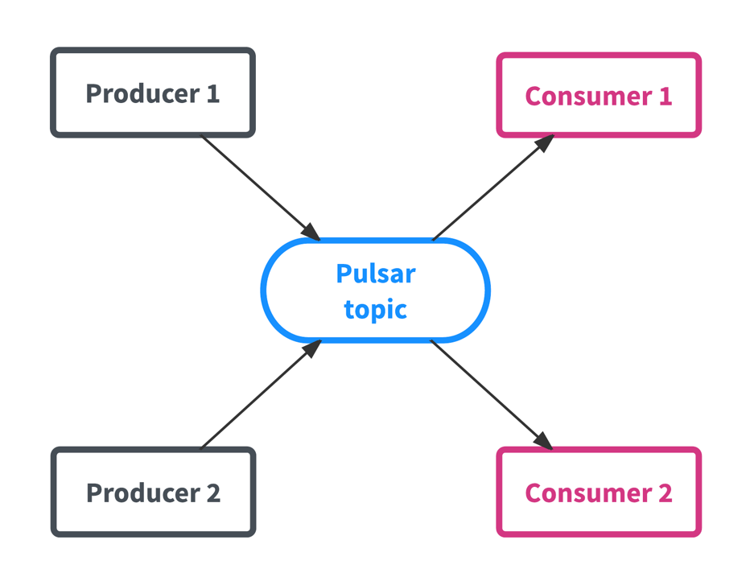
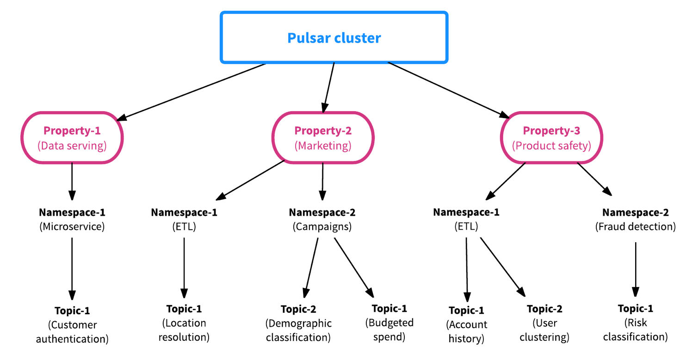
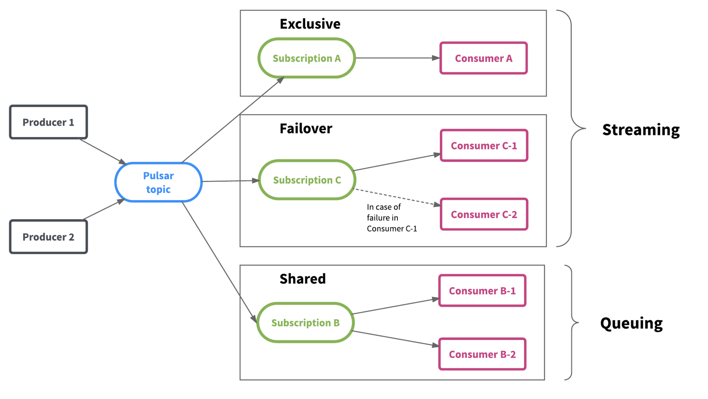
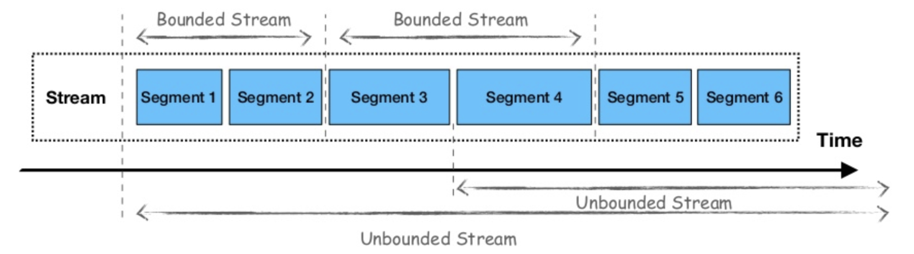
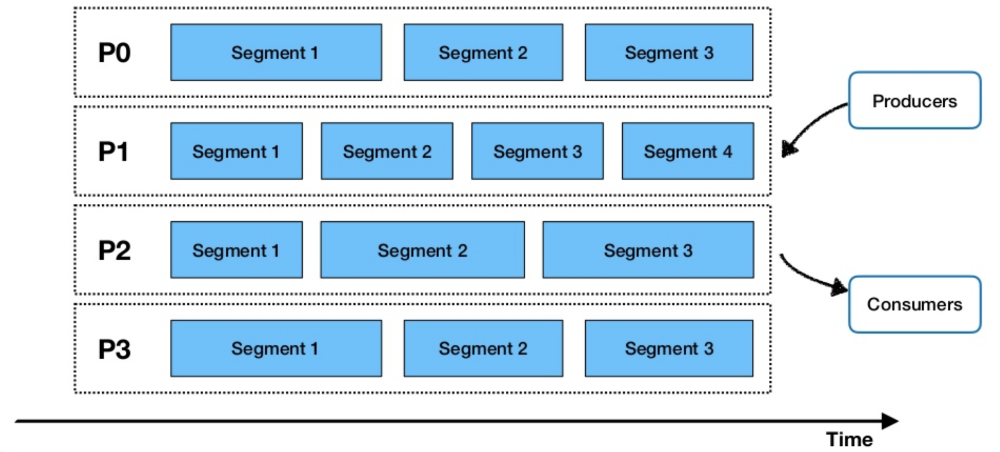

# When Flick & Pulsar Come Together

开源数据技术框架 `Apache Flink` 和 `Apache Pulsar` 可以通过不同方式集成，以提供大规模的弹性数据处理, 这里不作介绍

本文简要介绍 `Apache Pulsar` 及其与其他消息传递系统的区别，并描述 `Pulsar` 和 `Flink` 可以一起工作以提供无缝的开发人员体验以进行大规模弹性数据处理的方式。

## Apache Pulsar简介
- `Apache Pulsar` 是在 `Apache Software Foundation` 的领导下的一个开源分布式pub-sub消息传递系统。
- `Pulsar` 是用于服务器到服务器消息传递的多租户高性能解决方案
  - 对Pulsar实例中的多个集群的本机支持
  - 跨集群的消息无缝地理复制
  - 极低的发布和端到端的延迟
  - 对超过一百万个 `topic` 的无缝可伸缩性以及Apache BookKeeper等提供的持久性消息存储来确保消息传递。

现在让我们讨论Pulsar和其他pub-sub消息传递框架之间的主要区别：

第一个与众不同的因素是，尽管Pulsar提供了灵活的pub-sub消息传递系统，但它也得到了持久日志存储的支持-因此将消息传递和存储结合在一个框架下。由于采用了分层架构，Pulsar可以提供即时故障恢复，独立的可伸缩性和无平衡的群集扩展。

Pulsar的体系结构遵循与其他pub-sub系统类似的模式，因为该框架以 `topic` 为主要数据实体进行组织，生产者向该 `topic` 发送数据，而消费者从该 `topic` 接收数据，如下图所示。



Pulsar的第二个区别是，该框架是从一开始就考虑到多租户构建的。这意味着每个Pulsar `topic` 都有一个层次化的管理结构，使资源分配以及团队之间的资源管理和协调变得高效而轻松。借助Pulsar的多租户结构，数据平台维护人员可以毫不费力地加入新团队，因为Pulsar在属性（租户），名称空间或 `topic` 级别提供了资源隔离，同时可以跨集群共享数据，以方便协作和协调。



最后，Pulsar的灵活消息传递框架统一了流和排队数据消耗模型，并提供了更大的灵活性。如下图所示，Pulsar将数据保存在 `topic` 中，而多个团队可以根据其工作量和数据使用模式来独立使用数据。



## `Pulsar` 对数据的看法：`Segmented data streams`
Apache Flink是一个流优先的计算框架，将批处理视为流的一种特殊情况。Flink关于数据流的观点区分了有界数据流和无界数据流之间的批处理和流处理，假设对于批处理工作负载而言，数据流是有限的，并且有开始和结束。

关于数据层，Apache Pulsar与Apache Flink的观点相似。该框架还使用流作为所有数据的统一视图，而其分层体系结构则允许传统的pub-sub消息传递用于流式处理工作负载，以及连续数据处理或对分段和静态数据流使用分段流和绑定数据流。




使用Pulsar，一旦生产者将数据发送到某个 `topic`，它就会根据数据流量进行分区，然后在这些分区下进一步进行分段（使用Apache Bookkeeper作为分段存储），以允许并行数据处理，如下图所示。这允许在一个框架中结合传统的发布-订阅消息传递和分布式并行计算。



## Flink 和 Pulsar
`Apache Flink` 和 `Apache Pulsar` 已经以多种方式集成。在以下各节中，我将介绍框架之间未来的潜在集成，并分享可一起使用框架的现有方法示例。

### 潜在集成
Pulsar可以通过不同的方式与Apache Flink集成。一些潜在的集成包括使用流连接器来提供对流工作负载的支持，以及使用批处理源连接器来提供对批工作负载的支持。Pulsar还提供了对架构的本机支持，该架构可以与Flink集成并提供对数据的结构化访问，例如通过使用Flink SQL作为在Pulsar中查询数据的方式。最后，集成技术的另一种方法可以包括使用Pulsar作为Flink的状态存储。由于Pulsar具有分层体系结构（Streams和Segmented Streams，由Apache Bookkeeper支持），因此使用Pulsar作为存储层并存储Flink状态变得很自然。

从架构的角度来看，我们可以将这两个框架之间的集成想象为一个框架，该框架使用Apache Pulsar来获得数据层的统一视图，并使用Apache Flink作为统一的计算和数据处理框架和API。

### 现有集成
这两个框架之间的集成正在进行中，开发人员已经可以通过多种方式将Pulsar与Flink结合使用。例如，Pulsar可用作Flink DataStream应用程序中的流源和流接收器。开发人员可以将数据从Pulsar提取到Flink作业中，该作业会进行计算和处理实时数据，然后将数据作为流接收器发送回Pulsar `topic` 。这样的例子如下所示：

```java
// create and configure Pulsar consumer
PulsarSourceBuilder<String>builder = PulsarSourceBuilder
   .builder(new SimpleStringSchema())
   .serviceUrl(serviceUrl)
   .topic(inputTopic)
   .subscriptionName(subscription);
SourceFunction<String> src = builder.build();
// ingest DataStream with Pulsar consumer
DataStream<String> words = env.addSource(src);

// perform computation on DataStream (here a simple WordCount)
DataStream<WordWithCount> wc = words
   .flatMap((FlatMapFunction<String, WordWithCount>) (word, collector) -> {
       collector.collect(new WordWithCount(word, 1));
   })
   .returns(WordWithCount.class)
   .keyBy("word")
   .timeWindow(Time.seconds(5))
   .reduce((ReduceFunction<WordWithCount>) (c1, c2) ->
       new WordWithCount(c1.word, c1.count + c2.count));

// emit result via Pulsar producer
wc.addSink(new FlinkPulsarProducer<>(
   serviceUrl,
   outputTopic,
   new AuthenticationDisabled(),
   wordWithCount -> wordWithCount.toString().getBytes(UTF_8),
   wordWithCount -> wordWithCount.word)
);
```

开发人员可以利用的两个框架之间的另一个集成包括使用Pulsar作为Flink SQL或Table API查询的流源和流表接收器，如下例所示：

```java
// obtain a DataStream with words
DataStream<String> words = ...

// register DataStream as Table "words" with two attributes ("word", "ts"). 
//   "ts" is an event-time timestamp.
tableEnvironment.registerDataStream("words", words, "word, ts.rowtime");
// create a TableSink that produces to Pulsar
TableSink sink = new PulsarJsonTableSink(
   serviceUrl,
   outputTopic,
   new AuthenticationDisabled(),
   ROUTING_KEY);

// register Pulsar TableSink as table "wc"
tableEnvironment.registerTableSink(
   "wc",
   sink.configure(
      new String[]{"word", "cnt"},
      new TypeInformation[]{Types.STRING, Types.LONG}));

// count words per 5 seconds and write result to table "wc"
tableEnvironment.sqlUpdate(
   "INSERT INTO wc " +
   "SELECT word, COUNT(*) AS cnt " +
   "FROM words " +
   "GROUP BY word, TUMBLE(ts, INTERVAL '5' SECOND)");
```

最后，Flink与Pulsar集成在一起以处理批处理工作负载，作为批处理接收器，在Apache Flink在静态数据集中完成计算后，所有结果都将推送到Pulsar。这样的例子如下所示：

```java
// obtain DataSet from arbitrary computation
DataSet<WordWithCount> wc = ...

// create PulsarOutputFormat instance
OutputFormat pulsarOutputFormat = new PulsarOutputFormat(
   serviceUrl, 
   topic, 
   new AuthenticationDisabled(), 
   wordWithCount -> wordWithCount.toString().getBytes());

// write DataSet to Pulsar
wc.output(pulsarOutputFormat);
```

## 结论

`Pulsar` 和 `Flink` 都有一个类似的观点，即数据和应用程序的计算级别如何能够“流优先”，而批处理是一个特殊的流情况。

通过Pulsar的分段流方法和Flink在一个框架下统一批处理和流处理工作负载的步骤，可以通过多种方式将这两种技术集成在一起，提供大规模的弹性数据处理。