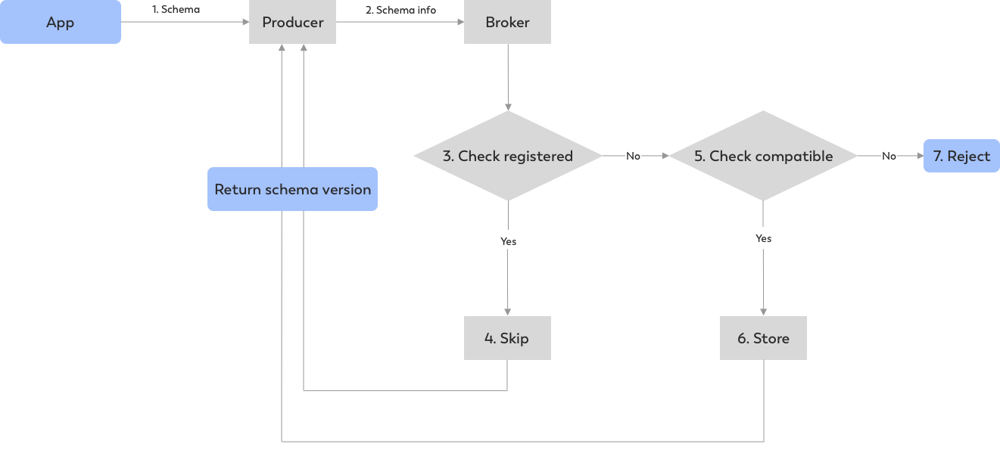

# How to query Pulsar Streams using Apache Flink

- 25 Nov 2019 Sijie Guo (@sijieg) & Markos Sfikas (@MarkSfik)

在Flink博客的上一个[Pulsar] (https://flink.apache.org/2019/05/03/pulsar-flink.html)中，我们解释了Apache Flink和Apache Pulsar可以集成以提供大规模弹性数据处理的不同方式。这篇博客文章讨论了两个框架之间的新发展和集成，并展示了如何利用Pulsar的内置`schema` 使用Apache Flink实时查询Pulsar流。

## Apache Pulsar的简短介绍

Apache Pulsar是一个灵活的发布(pub)/订阅(sub) 消息传递系统，支持持久的日志存储。框架的一些亮点包括多租户,一个统一的信息模型,构建事件流和原生云架构,使其适合广泛的一组用例,从计费、支付和交易服务到不同的消息传递的统一架构在一个组织

## 现有的Pulsar和Flink集成（Apache Flink 1.6+）
 `Pulsar` 和 `Flink` 之间现有的集成利用了 `Pulsar` 作为Flink应用程序中的消息队列。Flink开发人员可以利用 `Pulsar` 作为流源和流接收器，为他们的Flink应用程序选择一个特定的 `Pulsar` 源，并连接到他们想要的 `Pulsar` 集群和 `topic` :

```java
// create and configure Pulsar consumer
PulsarSourceBuilder<String>builder = PulsarSourceBuilder  
  .builder(new SimpleStringSchema()) 
  .serviceUrl(serviceUrl)
  .topic(inputTopic)
  .subsciptionName(subscription);
SourceFunction<String> src = builder.build();
// ingest DataStream with Pulsar consumer
DataStream<String> words = env.addSource(src);
```

 `Pulsar` 流可以连接到Flink处理逻辑…

```java
// perform computation on DataStream (here a simple WordCount)
DataStream<WordWithCount> wc = words
  .flatmap((FlatMapFunction<String, WordWithCount>) (word, collector) -> {
    collector.collect(new WordWithCount(word, 1));
  })
  .returns(WordWithCount.class)
  .keyBy("word")
  .timeWindow(Time.seconds(5))
  .reduce((ReduceFunction<WordWithCount>) (c1, c2) ->
    new WordWithCount(c1.word, c1.count + c2.count));
```

然后写回 `Pulsar` `(Sink)，将计算结果发送到下游，回到 `Pulsar`  `topic` :

```java
// emit result via Pulsar producer 
wc.addSink(new FlinkPulsarProducer<>(
  serviceUrl,
  outputTopic,
  new AuthentificationDisabled(),
  wordWithCount -> wordWithCount.toString().getBytes(UTF_8),
  wordWithCount -> wordWithCount.word)
);
```

虽然这是集成的第一步，但是现有的设计并没有充分利用 `Pulsar` 的能力。与Flink 1.6.0集成的一些缺点与 `Pulsar` 既没有被用作持久存储，也没有与Flink进行`schema` 集成有关，因此在描述应用程序的`schema` 注册时需要手工输入。

## `Pulsar` 与Flink 1.9的集成:使用 `Pulsar` 作为Flink目录
- Flink 1.9.0和 `Pulsar` 之间的最新集成解决了前面提到的大部分缺点。
- 阿里巴巴Blink对Flink存储库的贡献为处理框架增加了许多增强和新功能，使与 `Pulsar` 的集成更加强大和有影响力。Flink 1.9.0引入了 `Pulsar` `schema` 集成，使 `TABLE Api` 成为一等公民，并提供了 `exactly-once` 流 `source` 和 `at-least-once` 的 `Pulsar` 流 `sink`。
- 最后，通过`schema` 集成， `Pulsar` 现在可以注册为一个Flink目录，使得在 `Pulsar` 流上运行Flink查询只需几个命令。在接下来的部分中，我们将进一步研究新的集成，并提供如何使用Flink SQL查询 `Pulsar` 流的示例。

## Leveraging the Flink <> Pulsar Schema Integration
在深入研究集成细节以及如何使用Flink使用 `Pulsar` `schema` 之前，让我们先描述一下 `Pulsar` `schema` 是如何工作的。Apache Pulsar中的`schema` 已经共存，并充当框架代理端数据的表示，这使得带有外部系统的`schema` 注册表过时了。此外，Pulsar中的数据`schema` 与每个 `topic` 相关联，因此生产者和消费者都发送带有预定义`schema` 信息的数据，而代理执行`schema` 验证，并在兼容性检查中管理`schema` 多版本化和演进。

下面你可以在生产者和消费者两方面找到 `Pulsar` `schema` 的一个例子。在生产者端，您可以指定要使用哪个`schema` ，然后 `Pulsar` 发送一个POJO类，而不需要执行任何序列化/反序列化。类似地，在消费者端，您还可以指定数据`schema` ，当接收到数据时，Pulsar将自动验证`schema` 信息，获取给定版本的`schema` ，然后将数据反序列化回POJO结构。 `Pulsar` 将`schema` 信息存储在 `Pulsar`  `topic` 的元数据中。

```java
// Create producer with Struct schema and send messages
Producer<User> producer = client.newProducer(Schema.AVRO(User.class)).create();
producer.newMessage()
  .value(User.builder()
    .userName(“pulsar-user”)
    .userId(1L)
    .build())
  .send();
```

//创建具有结构`schema` 的消费者并接收消息

```java
// Create consumer with Struct schema and receive messages
Consumer<User> consumer = client.newCOnsumer(Schema.AVRO(User.class)).create();
consumer.receive();
```

假设我们有一个应用程序，它为生产者和/或消费者指定了一个`schema` `。接收到`schema` 信息后，连接到代理的生产者(或消费者)将传输这些信息，以便代理在返回或拒绝`schema` 之前执行`schema` 注册、验证和`schema` 兼容性检查，如下图所示:





 `Pulsar` 不仅能够处理和存储`schema` 信息，而且还能够在必要时处理任何`schema` 演化。Pulsar将有效地管理代理中的任何`schema` 演化，在执行任何必要的兼容性检查时，跟踪`schema` 的所有不同版本。

此外，当消息在生产者端发布时，Pulsar将使用`schema` 版本标记每个消息，作为每个消息元数据的一部分。在消费者端，当接收到消息并对元数据进行反序列化时，Pulsar将检查与此消息关联的`schema` 版本，并从代理获取相应的`schema` 信息。因此，当 `Pulsar` 与Flink应用程序集成时，它使用预先存在的`schema` 信息，并将带有`schema` 信息的单个消息映射到Flink类型系统中的不同行。

的情况下当Flink用户不与`schema` 直接或利用原始`schema` (例如,使用一个 `topic` 来存储字符串或长数量), `Pulsar` 要么消息有效负载转换成Flink行,称为“价值”或结构化`schema` 类型的情况下,比如JSON和AVRO—— `Pulsar` 将从`schema` 中提取单个字段信息,并将这些字段映射Flink的类型系统。最后，与每个消息相关的所有元数据信息(如消息键、 `topic` 、发布时间或事件时间)将被转换为Flink行中的元数据字段。下面我们提供了两个原始`schema` 和结构化`schema` 类型的示例，以及如何将它们从 `Pulsar`  `topic` 转换为Flink的类型系统。


一旦所有`schema` 信息都映射到Flink的类型系统，您就可以开始在Flink中根据指定的`schema` 信息构建 `Pulsar` 源、接收器或目录，如下图所示:

Flink＆Pulsar：从Pulsar读取数据
创建用于流查询的Pulsar源

```scala
val env = StreamExecutionEnvironment.getExecutionEnvironment
val props = new Properties()
props.setProperty("service.url", "pulsar://...")
props.setProperty("admin.url", "http://...")
props.setProperty("partitionDiscoveryIntervalMillis", "5000")
props.setProperty("startingOffsets", "earliest")
props.setProperty("topic", "test-source-topic")
val source = new FlinkPulsarSource(props)
// you don't need to provide a type information to addSource since FlinkPulsarSource is ResultTypeQueryable
val dataStream = env.addSource(source)(null)

// chain operations on dataStream of Row and sink the output
// end method chaining

env.execute()
```

在Pulsar中将 `topic` 注册为流表
```scala
val env = StreamExecutionEnvironment.getExecutionEnvironment
val tEnv = StreamTableEnvironment.create(env)

val prop = new Properties()
prop.setProperty("service.url", serviceUrl)
prop.setProperty("admin.url", adminUrl)
prop.setProperty("flushOnCheckpoint", "true")
prop.setProperty("failOnWrite", "true")
props.setProperty("topic", "test-sink-topic")

tEnv
  .connect(new Pulsar().properties(props))
  .inAppendMode()
  .registerTableSource("sink-table")

val sql = "INSERT INTO sink-table ....."
tEnv.sqlUpdate(sql)
env.execute()
```

创建用于流查询的Pulsar接收器
```scala
val env = StreamExecutionEnvironment.getExecutionEnvironment
val stream = .....

val prop = new Properties()
prop.setProperty("service.url", serviceUrl)
prop.setProperty("admin.url", adminUrl)
prop.setProperty("flushOnCheckpoint", "true")
prop.setProperty("failOnWrite", "true")
props.setProperty("topic", "test-sink-topic")

stream.addSink(new FlinkPulsarSink(prop, DummyTopicKeyExtractor))
env.execute()
```

将流表写入Pulsar
```scala
val env = StreamExecutionEnvironment.getExecutionEnvironment
val tEnv = StreamTableEnvironment.create(env)

val prop = new Properties()
prop.setProperty("service.url", serviceUrl)
prop.setProperty("admin.url", adminUrl)
prop.setProperty("flushOnCheckpoint", "true")
prop.setProperty("failOnWrite", "true")
props.setProperty("topic", "test-sink-topic")

tEnv
  .connect(new Pulsar().properties(props))
  .inAppendMode()
  .registerTableSource("sink-table")

val sql = "INSERT INTO sink-table ....."
tEnv.sqlUpdate(sql)
env.execute()
```

在每个实例中，Flink开发人员只需要指定Flink将如何连接到 `Pulsar` 集群的属性，而无需担心任何`schema` 注册、序列化/反序列化操作，并将 `Pulsar` 集群注册为Flink中的源、接收器或流表。一旦这三个元素都放在一起， `Pulsar` 就可以在Flink中注册为目录，这大大简化了处理和查询数据的方式，例如编写程序从 `Pulsar` 查询数据，或者使用表API和SQL查询 `Pulsar` 数据流。

下一步&未来的集成
Pulsar和Flink之间集成的目标是简化开发人员如何使用这两个框架来构建统一的数据处理堆栈。当我们从经典的Lamda架构(其中在线的、高速的层与离线的、批处理的层相结合以运行数据计算)发展时，Flink和 `Pulsar` 在提供真正统一的数据处理堆栈方面提供了一个很好的组合。我们将Flink视为一个统一的计算引擎，处理在线(流)和离线(批)工作负载，而Pulsar作为一个统一的数据存储层，用于简化开发人员工作负载的真正统一的数据处理堆栈。

仍然有很多正在进行的工作和努力从社区得到集成更好,如一个新的源API (FLIP-27)将允许 `Pulsar` 连接器Flink社区的贡献以及一个新的订阅类型称为 `Pulsar` Key_Shared订阅类型,允许有效的源并行扩展。额外的工作重点在于提供端到端的、精确的一次性保证(目前只能在源 `Pulsar` 连接器中使用，而不是在接收 `Pulsar` 连接器中)，以及更多地将 `Pulsar` /BookKeeper用作Flink状态后端。

你可以在这段来自Flink Forward Europe 2019的视频中找到关于这两个社区之间集成工作的更详细的概述，或者在Flink dev邮件列表中注册以获得Flink和 `Pulsar` 之间最新的贡献和集成工作。

