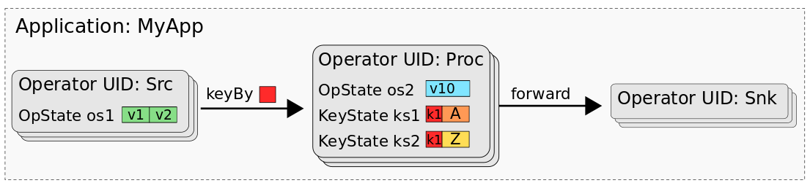
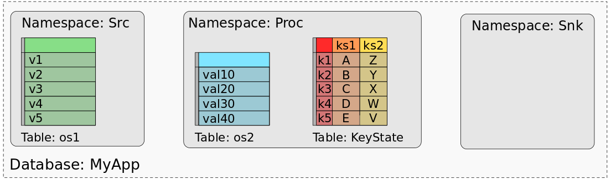

## The State Processor API: How to Read, write and modify the state of Flink applications

---

2019年9月13日 Seth Wiesman (@sjwiesman) & Fabian Hueske (@fhueske)

无论你是在生产或在过去作为一个计算框架评估Flink运行Apache Flink,你可能发现自己问一个问题:我如何访问,写或更新在`Flink savepoint`的状态? `State Processor API`，这是DataSet API的一个强大扩展，允许在Flink的保存点和检查点中读取、写入和修改状态。

在这篇文章中，我们将解释为什么这个特性对于Flink来说是一个很大的进步，您可以使用它来做什么，以及如何使用它。最后，我们将讨论`State Processor API`的未来，以及它如何与我们将Flink演化为统一的批处理和流处理系统的计划相一致。

---

### Stateful stream Processing with Apache until Flink 1.9

所有`non-trivial`的流处理应用程序都是有状态的，其中大多数都设计为运行数月或数年。随着时间的推移，他们中的许多人积累了大量宝贵的状态，这些状态可能非常昂贵，甚至无法重建，如果由于失败而丢失了这些状态。为了保证应用程序状态的一致性和持久性，Flink从很早的时候就采用了一种复杂的检查点和恢复机制。随着每个版本的发布，Flink社区都添加了越来越多的状态相关特性，以提高检查点和恢复速度、应用程序的维护以及管理应用程序的实践。

然而，Flink用户通常要求的一个特性是能够“from the outside”访问应用程序的状态。这个请求是出于需要验证或调试应用程序,应用程序的状态迁移到另一个应用程序,发展应用程序从堆中后端到RocksDB状态后端,或从外部导入应用程序的初始状态系统像一个关系数据库。

尽管有那么多令人信服的理由在外部公开应用程序状态，但到目前为止，您的访问选项还是相当有限的。Flink的可查询状态特性只支持`key-lookups`(`point queries`)，并不保证返回值的一致性(`key`的值在应用程序从失败中恢复之前和之后可能是不同的)。此外，可查询状态不能用于添加或修改应用程序的状态。此外，由于应用程序状态是用自定义二进制格式编码的，所以无法访问保存点(保存点是应用程序状态的一致快照)。

---

### Reading and Writing Application State with the State Processor API

Flink 1.9附带的状态处理器API在如何处理应用程序状态方面是一个真正的游戏规则改变者!简而言之，它使用输入和输出格式扩展了`DataSet API`，以读写保存点或检查点数据。由于`DataSet`和`Table API`的互操作性，您甚至可以使用关系`Table API`或`SQL`查询来分析和处理状态数据。

例如，您可以使用正在运行的流处理应用程序的保存点，并使用数据集批处理程序对其进行分析，以验证应用程序的行为是否正确。或者，您可以从任何存储区读取一批数据，对其进行预处理，并将结果写入保存点，用于引导流应用程序的状态。现在还可以修复不一致的状态项。最后，状态处理器API提供了许多方法来演化有状态应用程序，这些有状态应用程序以前被参数和设计选择所阻塞，如果更改这些参数和设计选择，则在启动应用程序之后就会丢失应用程序的所有状态。例如，现在可以任意修改状态的数据类型、调整操作符的最大并行度、拆分或合并操作符状态、重新分配操作符uid等等。

---

### Mapping Application State to DataSets

状态处理器API将流应用程序的状态映射到一个或多个可以单独处理的数据集。为了能够使用API，您需要了解这个映射是如何工作的。

但是，让我们首先看看有状态Flink作业是什么样子的。Flink作业由操作符(通常是一个或多个源操作符)、几个实际处理操作符和一个或多个接收器操作符组成。每个操作符在一个或多个任务中并行运行，可以处理不同类型的状态。操作符可以有零个、一个或多个“操作符状态”，这些“操作符状态”被组织为列表，列表的范围限定于操作符的任务。如果操作符应用于键控流，它也可以有零个、一个或多个“键控状态”，这些“键控状态”的作用域为从每个处理过的记录中提取的键。您可以将键控状态看作分布式键值映射。

下图显示了应用程序“MyApp”，它由三个名为“Src”、“Proc”和“Snk”的操作符组成。`Src`有一个操作符状态(`os1`)， `Proc`有一个操作符状态(`os2`)和两个键控状态(`ks1`, `ks2`)， `Snk`是无状态的。

`MyApp`的`savepoint`或`checkpoint`由所有状态的数据组成，以一种可以恢复每个任务状态的方式组织。当使用批处理作业处理保存点(或检查点)的数据时，我们需要一个`mental model`，将各个任务的数据状态映射到`data sets`或`tables`中。事实上，我们可以将保存点看作数据库。每个操作符(由其UID标识)都表示一个名称空间。操作符的每个操作符状态都映射到名称空间中的一个专用表，其中有一个列保存所有任务的状态数据。操作符的所有键态都映射到一个表，该表由一个键态列和保存每个键控状态的列组成。下图显示了如何将MyApp的保存点映射到数据库。

图中显示了Src操作符状态的值如何映射到一个包含一列五行的表中，其中一行表示Src所有并行任务的所有列表条目。操作符“Proc”的操作符状态os2类似地映射到单个表。键控状态ks1和ks2组合成一个包含三列的表，一列用于键，一列用于ks1，一列用于ks2。键控表为这两种键控状态的每个不同键保存一行。因为操作符“Snk”没有任何状态，所以它的名称空间是空的。

状态处理器API现在提供了创建、加载和编写保存点的方法。您可以从加载的保存点读取数据集，或者将数据集转换为状态并将其添加到保存点。可以使用DataSet API的完整功能集处理数据集。使用这些构建块，可以处理前面提到的所有用例(以及更多)。如果您想详细了解如何使用状态处理器API，请参阅[文档](https://ci.apache.org/projects/flink/flink-docs-release-1.9/dev/libs/state_processor_api.html)。

---

### Why DataSet API?

如果您熟悉Flink的路线图，您可能会惊讶于状态处理器API是基于DataSet API的。Flink社区计划使用BoundedStreams概念扩展DataStream API，并反对使用DataSet API。在设计该特性时，我们还评估了DataStream API或表API，但它们都不能提供正确的特性集。因为我们不想在Flink API的开发过程中阻止这个特性，所以我们决定在DataSet API上构建它，但是将它对DataSet API的依赖关系保持在最小。因此，将其迁移到另一个API应该相当容易。

---
### Summary

Flink用户很长时间以来一直要求从外部访问和修改流媒体应用程序的状态。使用状态处理器API, Flink 1.9.0最终将应用程序状态公开为可操作的数据格式。该特性为用户如何维护和管理Flink流应用程序提供了许多新的可能性，包括流应用程序的任意演化以及应用程序状态的导出和引导。简而言之，状态处理器API解锁了以前保存点所在的黑盒子。

