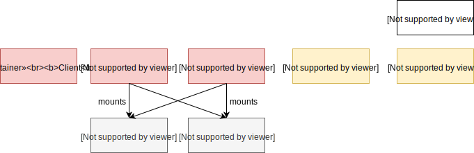
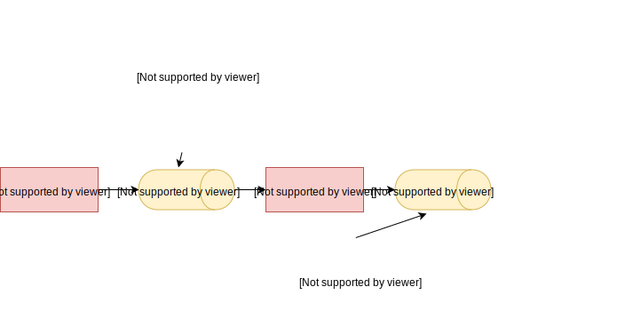
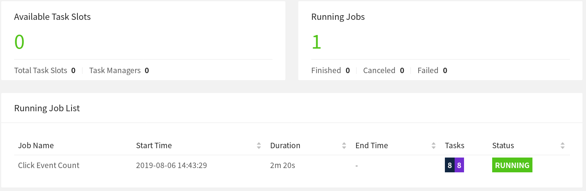

## Flink Operations Playground
在各种环境中部署和操作Apache Flink有很多方法。不管这种类型如何，Flink集群的基本构建块保持不变，并应用类似的操作原则。

在这个`playground`上，你将学习如何管理和运行Flink作业。您将了解如何部署和监视应用程序，体验Flink如何从作业失败中恢复，以及执行日常操作任务，如升级和重新缩放。

### Anatomy of this Playground
这个`playground`由一个长寿的Flink会话集群和一个Kafka集群组成。

一个Flink集群总是由一个Flink Master和一个或多个Flink任务管理器组成。Flink Master负责处理作业提交、作业监督以及资源管理。Flink任务管理器是工作进程，负责执行组成Flink作业的实际任务。在这个`playground`上，您将从一个任务管理器开始，但是稍后扩展到更多的任务管理器。此外，这个`playground`还提供了一个专用的客户机容器，我们最初使用该容器提交Flink作业，然后使用它执行各种操作任务。Flink集群本身并不需要客户机容器，但是为了便于使用而包含了客户机容器。

Kafka集群由一个Zookeeper服务器和一个Kafka代理组成。



当`playground`启动时，将向Flink Master提交一个名为Flink Event Count的Flink作业。此外，还创建了两个Kafka主题输入和输出。



单击事件计数示例

该作业使用来自输入主题的ClickEvents，每个事件都有一个时间戳和一个页面。然后按页面键控事件，并在15秒的窗口内计数。结果被写入输出主题。

有6个不同的页面，每个页面生成1000个单击事件，耗时15秒。因此，Flink作业的输出应该显示每个页面和窗口的1000个视图。

### Starting the Playground

`playground`环境的设置只需几步。我们将向您介绍必要的命令，并演示如何验证所有操作是否正确。

我们假设您的机器上安装了docker(1.12+)和docker- composition(2.1+)。

所需的配置文件可以在flink-playgrounds存储库中找到。看看它，让环境变得更美好:

```bash
git clone --branch release-1.9 https://github.com/apache/flink-playgrounds.git
cd flink-playgrounds/operations-playground
docker-compose build
docker-compose up -d
```

然后，你可以用以下命令检查正在运行的Docker容器:
```

                    Name                                  Command               State                   Ports                
-----------------------------------------------------------------------------------------------------------------------------
operations-playground_clickevent-generator_1   /docker-entrypoint.sh java ...   Up       6123/tcp, 8081/tcp                  
operations-playground_client_1                 /docker-entrypoint.sh flin ...   Exit 0                                       
operations-playground_jobmanager_1             /docker-entrypoint.sh jobm ...   Up       6123/tcp, 0.0.0.0:8081->8081/tcp    
operations-playground_kafka_1                  start-kafka.sh                   Up       0.0.0.0:9094->9094/tcp              
operations-playground_taskmanager_1            /docker-entrypoint.sh task ...   Up       6123/tcp, 8081/tcp                  
operations-playground_zookeeper_1              /bin/sh -c /usr/sbin/sshd  ...   Up       2181/tcp, 22/tcp, 2888/tcp, 3888/tcp

```

这表明客户机容器已经成功提交了Flink作业(退出0)，所有集群组件以及数据生成器都在运行(运行中)。

你可致电:

```bash
docker-compose down -v
```

### Entering the Playground

在这个`playground`上你可以尝试和检查很多东西。在下面的两部分中，我们将向您展示如何与Flink集群交互，并演示Flink的一些关键特性。

#### Flink WebUI

观察Flink集群最自然的起点是在http://localhost:8081下公开的Web UI。如果一切顺利，您将看到集群最初由一个TaskManager组成，并执行一个名为Click Event Count的作业。


`Flink WebUI`包含许多关于Flink集群及其作业的有用且有趣的信息(JobGraph、度量、检查点统计信息、TaskManager状态等)。

### Logs
**JobManager**

可以通过`docker-compose`跟踪`JobManager`日志。

```bash
docker-compose logs -f jobmanager
```

在初始启动之后，您应该主要看到每个检查点完成后的日志消息。

**TaskManager**

可以用同样的方法跟踪TaskManager日志。

```bash
docker-compose logs -f taskmanager
```

在初始启动之后，您应该主要看到每个检查点完成后的日志消息。

#### Flink CLI
`Flink CLI`可以在客户机容器中使用。例如，要打印`Flink CLI`的帮助消息，可以运行它

```bash
docker-compose run --no-deps client flink --help
```

#### Flink REST API
`Flink REST API`通过主机上的`localhost:8081`或客户端容器上的`jobmanager:8081`公开，例如，要列出所有当前运行的作业，可以运行:

```bash
curl localhost:8081/jobs
```

### Kafka Topics
您可以通过运行查看写入Kafka主题的记录

```bash
//input topic (1000 records/s)
docker-compose exec kafka kafka-console-consumer.sh \
  --bootstrap-server localhost:9092 --topic input

//output topic (24 records/min)
docker-compose exec kafka kafka-console-consumer.sh \
  --bootstrap-server localhost:9092 --topic output
```

### Time to Play
既然您已经学习了如何与`Flink`和`Docker`容器交互，那么让我们来看看一些常见的操作任务，您可以在我们的`playground`上尝试这些任务。所有这些任务都是相互独立的，即你可以按任何顺序来做。大多数任务都可以通过`CLI`和`REST API`执行。

#### Listing Running Jobs

- CLI
  - Command
```bash
docker-compose run --no-deps client flink list
```

  - Expected Output
```job
Waiting for response...
------------------ Running/Restarting Jobs -------------------
16.07.2019 16:37:55 : <job-id> : Click Event Count (RUNNING)
--------------------------------------------------------------
No scheduled jobs.
```

- REST API
  - Request
```bash
curl localhost:8081/jobs
```

  - Expected Response (pretty=printed)
```json
{
  "jobs": [
    {
      "id": "<job-id>",
      "status": "RUNNING"
    }
  ]
}
```
JobID在提交时分配给作业，并且需要通过CLI或REST API对作业执行操作。

#### Observing Failure & Recovery
Flink在(部分)故障下提供了精确的一次处理保证。在这个`playground`上，你可以观察并在一定程度上验证这种行为。

##### **Step 1: Observing the Output**

如上所述，生成这个`playground`中的事件时，每个窗口刚好包含1000条记录。因此，为了验证Flink在没有数据丢失或重复的情况下成功地从任务管理器故障中恢复，您可以跟踪输出主题，并在恢复之后检查所有窗口是否都存在，并且计数是否正确。

为此，从输出主题开始读取，并让此命令一直运行到恢复之后(步骤3)。

```bash
docker-compose exec kafka kafka-console-consumer.sh \
  --bootstrap-server localhost:9092 --topic output
```

##### **Step2: Introducing a Fault**

为了模拟部分故障，可以杀死TaskManager。在生产设置中，这可能对应于TaskManager进程、TaskManager机器的丢失，或者只是框架或用户代码抛出的临时异常(例如，由于外部资源暂时不可用)。

```bash
docker-compose kill taskmanager
```

几秒钟后，`Flink`将注意到`TaskManager`的丢失，取消受影响的作业，并立即重新提交它以进行恢复。当作业重新启动时，它的任务仍然处于计划状态，这由紫色方块表示(参见下面的屏幕截图)。



**注意**:即使作业的任务处于计划状态且尚未运行，作业的总体状态仍显示为正在运行。

此时，作业的任务不能从计划状态转移到运行状态，因为没有资源(taskmanager提供的任务堆)来运行任务。在新任务管理器可用之前，工作将经历一个取消和重新提交的循环。

与此同时，数据生成器不断将ClickEvents推入输入主题。这类似于实际的生产设置，即在处理数据的作业停止时生成数据。

##### **Step3: Recovery**

一旦重启`TaskManager`，它就会重新连接到主机。

```bash
docker-compose up -d taskmanager
```

当通知主任务管理器有关新任务管理器时，它将恢复作业的任务调度到新可用的任务组。在重新启动时，任务从故障前的最后一个成功检查点恢复状态，并切换到**`RUNNING`**状态。

该作业将快速处理Kafka的全部输入事件积压(在停机期间积累的)，并以更高的速度生成输出(> 24记录/分钟)，直到到达流的头部。在输出中，您将看到所有键(页)都出现在所有时间窗口中，并且每个计数都恰好是1000。因为我们正在使用FlinkKafkaProducer的“至少一次”模式，所以有可能会看到一些重复的输出记录。

**注意**:大多数生产设置依赖于资源管理器(Kubernetes、Yarn、Mesos)自动重启失败的进程。

#### Upgrading & Rescaling a Job
升级Flink作业通常包括两个步骤:首先，用保存点优雅地停止Flink作业。保存点是在定义良好的、全局一致的时间点(类似于检查点)上完整应用程序状态的一致快照。其次，升级`Flink`作业从保存点开始。在这种情况下，`upgrade`可以有不同的含义，包括以下内容:

- 对配置的升级(包括作业的并行性)
- 对作业拓扑的升级(添加/删除操作符)
- 对作业的用户定义函数的升级

在开始升级之前，您可能希望开始跟踪输出主题，以便观察在升级过程中没有丢失或损坏数据。

```bash
docker-compose exec kafka kafka-console-consumer.sh \
  --bootstrap-server localhost:9092 --topic output
```

##### **Step1: Stopping the Job**

要优雅地停止作业，您需要使用CLI或REST API的“stop”命令。为此，您将需要作业的JobID，您可以通过列出所有正在运行的作业或从WebUI获得JobID。有了JobID，你可以继续停止工作:

- CLI
  - Command
```bash
docker-compose run --no-deps client flink stop <job-id>
```

  - Expected Output

```bash
Suspending job "<job-id>" with a savepoint.
Suspended job "<job-id>" with a savepoint.
```

保存点在flink-conf.yaml配置文件中,已存储到 state.savepoint.dir。 安装在本地机器上 *`/tmp/flink-savepoints-directory/`*目录下。您将在下一步中需要到此保存点的路径。对于REST API，这个路径已经是响应的一部分，您需要直接查看文件系统。
  - Command
```bash
ls -lia /tmp/flink-savepoints-directory
```

  - Expected Output

```log
total 0
  17 drwxr-xr-x   3 root root   60 17 jul 17:05 .
   2 drwxrwxrwt 135 root root 3420 17 jul 17:09 ..
1002 drwxr-xr-x   2 root root  140 17 jul 17:05 savepoint-<short-job-id>-<uuid>
```

- REST API
  - **Request**

```bash
# triggering stop
curl -X POST localhost:8081/jobs/<job-id>/stop -d '{"drain": false}'
```

  - **Expected Response (pretty-printed)**

```json
{
  "request-id": "<trigger-id>"
}
```

  - Request
```bash
# check status of stop action and retrieve savepoint path
 curl localhost:8081/jobs/<job-id>/savepoints/<trigger-id>
```

  - **Expected Response (pretty-printed)**
```json
{
  "status": {
    "id": "COMPLETED"
  },
  "operation": {
    "location": "<savepoint-path>"
  }
```

##### Step 2a: Restart Job without Changes  

现在可以从这个保存点重新启动升级后的作业。为了简单起见，您可以不做任何更改就重新启动它。
- CLI
  - Command

```bash
docker-compose run --no-deps client flink run -s <savepoint-path> \
  -d /opt/ClickCountJob.jar \
  --bootstrap.servers kafka:9092 --checkpointing --event-time
```

  - Expected Output

```bash
Starting execution of program
Job has been submitted with JobID <job-id>
```

- REST API
  - Request

# Uploading the JAR from the Client container
```bash
docker-compose run --no-deps client curl -X POST -H "Expect:" \
  -F "jarfile=@/opt/ClickCountJob.jar" http://jobmanager:8081/jars/upload
  
  - Expected Response (pretty-printed)
```

```json
{
  "filename": "/tmp/flink-web-<uuid>/flink-web-upload/<jar-id>",
  "status": "success"
}
```

  - Request

# Submitting the Job
```bash
curl -X POST http://localhost:8081/jars/<jar-id>/run \
  -d '{"programArgs": "--bootstrap.servers kafka:9092 --checkpointing --event-time", "savepointPath": "<savepoint-path>"}'

  - Expected Response (pretty-printed)
```

```json
{
  "jobid": "<job-id>"
}
```


一旦作业再次运行，您将在输出主题中看到，当作业处理停机期间积累的积压时，记录的生成速度会更高。此外，您将看到在升级过程中没有丢失任何数据:所有窗口的计数都正好是1000。

##### Step 2b: Restart Job with a Different Parallelism (Rescaling)

另外，您还可以通过在重新提交期间传递不同的并行度，从这个保存点重新调整作业。

- CLI
  - Command

```bash
docker-compose run --no-deps client flink run -p 3 -s <savepoint-path> \
  -d /opt/ClickCountJob.jar \
  --bootstrap.servers kafka:9092 --checkpointing --event-time
```

  - Expected Output
```log
Starting execution of program
Job has been submitted with JobID <job-id>
```

- REST API
  - Request

```bash
# Uploading the JAR from the Client container
docker-compose run --no-deps client curl -X POST -H "Expect:" \
  -F "jarfile=@/opt/ClickCountJob.jar" http://jobmanager:8081/jars/upload
```

  - Expected Response (pretty-printed)
```json
{
  "filename": "/tmp/flink-web-<uuid>/flink-web-upload/<jar-id>",
  "status": "success"
}
```

  - Request

```bash
# Submitting the Job
curl -X POST http://localhost:8081/jars/<jar-id>/run \
  -d '{"parallelism": 3, "programArgs": "--bootstrap.servers kafka:9092 --checkpointing --event-time", "savepointPath": "<savepoint-path>"}'
```

  - Expected Response (pretty-printed
```json
{
  "jobid": "<job-id>"
}
```

现在，作业已经重新提交，但是它不会启动，因为随着并行性的增加，没有足够的任务堆来执行它(可用2个，需要3个)。与

```bash
docker-compose scale taskmanager=2
```

您可以向Flink集群添加第二个带有两个任务批次的TaskManager，它将自动注册到Flink Master。添加TaskManager后不久，作业应该会再次运行。

一旦作业再次“运行”，您将在输出主题中看到，现在数据在重新缩放期间丢失:所有窗口都显示了一个正好为1000的计数。

#### Querying the Metrics of a Job
`Flink Master`通过其REST API公开系统和用户指标。

端点取决于这些度量的范围。范围为作业的指标可以通过*`jobs/<job-id>/metrics`*列出。度量的实际值可以通过get查询参数查询。

- Request
```bash
curl "localhost:8081/jobs/<jod-id>/metrics?get=lastCheckpointSize"
```

- Expected Response (pretty-printed; no placeholders)

```json
[
  {
    "id": "lastCheckpointSize",
    "value": "9378"
  }
]
```

REST API不仅可以用于查询指标，还可以检索关于正在运行的作业状态的详细信息。

- Request
```bash
# find the vertex-id of the vertex of interest
curl localhost:8081/jobs/<jod-id>
```

- Expected Response (pretty-printed)
```json
{
  "jid": "<job-id>",
  "name": "Click Event Count",
  "isStoppable": false,
  "state": "RUNNING",
  "start-time": 1564467066026,
  "end-time": -1,
  "duration": 374793,
  "now": 1564467440819,
  "timestamps": {
    "CREATED": 1564467066026,
    "FINISHED": 0,
    "SUSPENDED": 0,
    "FAILING": 0,
    "CANCELLING": 0,
    "CANCELED": 0,
    "RECONCILING": 0,
    "RUNNING": 1564467066126,
    "FAILED": 0,
    "RESTARTING": 0
  },
  "vertices": [
    {
      "id": "<vertex-id>",
      "name": "ClickEvent Source",
      "parallelism": 2,
      "status": "RUNNING",
      "start-time": 1564467066423,
      "end-time": -1,
      "duration": 374396,
      "tasks": {
        "CREATED": 0,
        "FINISHED": 0,
        "DEPLOYING": 0,
        "RUNNING": 2,
        "CANCELING": 0,
        "FAILED": 0,
        "CANCELED": 0,
        "RECONCILING": 0,
        "SCHEDULED": 0
      },
      "metrics": {
        "read-bytes": 0,
        "read-bytes-complete": true,
        "write-bytes": 5033461,
        "write-bytes-complete": true,
        "read-records": 0,
        "read-records-complete": true,
        "write-records": 166351,
        "write-records-complete": true
      }
    },
    {
      "id": "<vertex-id>",
      "name": "Timestamps/Watermarks",
      "parallelism": 2,
      "status": "RUNNING",
      "start-time": 1564467066441,
      "end-time": -1,
      "duration": 374378,
      "tasks": {
        "CREATED": 0,
        "FINISHED": 0,
        "DEPLOYING": 0,
        "RUNNING": 2,
        "CANCELING": 0,
        "FAILED": 0,
        "CANCELED": 0,
        "RECONCILING": 0,
        "SCHEDULED": 0
      },
      "metrics": {
        "read-bytes": 5066280,
        "read-bytes-complete": true,
        "write-bytes": 5033496,
        "write-bytes-complete": true,
        "read-records": 166349,
        "read-records-complete": true,
        "write-records": 166349,
        "write-records-complete": true
      }
    },
    {
      "id": "<vertex-id>",
      "name": "ClickEvent Counter",
      "parallelism": 2,
      "status": "RUNNING",
      "start-time": 1564467066469,
      "end-time": -1,
      "duration": 374350,
      "tasks": {
        "CREATED": 0,
        "FINISHED": 0,
        "DEPLOYING": 0,
        "RUNNING": 2,
        "CANCELING": 0,
        "FAILED": 0,
        "CANCELED": 0,
        "RECONCILING": 0,
        "SCHEDULED": 0
      },
      "metrics": {
        "read-bytes": 5085332,
        "read-bytes-complete": true,
        "write-bytes": 316,
        "write-bytes-complete": true,
        "read-records": 166305,
        "read-records-complete": true,
        "write-records": 6,
        "write-records-complete": true
      }
    },
    {
      "id": "<vertex-id>",
      "name": "ClickEventStatistics Sink",
      "parallelism": 2,
      "status": "RUNNING",
      "start-time": 1564467066476,
      "end-time": -1,
      "duration": 374343,
      "tasks": {
        "CREATED": 0,
        "FINISHED": 0,
        "DEPLOYING": 0,
        "RUNNING": 2,
        "CANCELING": 0,
        "FAILED": 0,
        "CANCELED": 0,
        "RECONCILING": 0,
        "SCHEDULED": 0
      },
      "metrics": {
        "read-bytes": 20668,
        "read-bytes-complete": true,
        "write-bytes": 0,
        "write-bytes-complete": true,
        "read-records": 6,
        "read-records-complete": true,
        "write-records": 0,
        "write-records-complete": true
      }
    }
  ],
  "status-counts": {
    "CREATED": 0,
    "FINISHED": 0,
    "DEPLOYING": 0,
    "RUNNING": 4,
    "CANCELING": 0,
    "FAILED": 0,
    "CANCELED": 0,
    "RECONCILING": 0,
    "SCHEDULED": 0
  },
  "plan": {
    "jid": "<job-id>",
    "name": "Click Event Count",
    "nodes": [
      {
        "id": "<vertex-id>",
        "parallelism": 2,
        "operator": "",
        "operator_strategy": "",
        "description": "ClickEventStatistics Sink",
        "inputs": [
          {
            "num": 0,
            "id": "<vertex-id>",
            "ship_strategy": "FORWARD",
            "exchange": "pipelined_bounded"
          }
        ],
        "optimizer_properties": {}
      },
      {
        "id": "<vertex-id>",
        "parallelism": 2,
        "operator": "",
        "operator_strategy": "",
        "description": "ClickEvent Counter",
        "inputs": [
          {
            "num": 0,
            "id": "<vertex-id>",
            "ship_strategy": "HASH",
            "exchange": "pipelined_bounded"
          }
        ],
        "optimizer_properties": {}
      },
      {
        "id": "<vertex-id>",
        "parallelism": 2,
        "operator": "",
        "operator_strategy": "",
        "description": "Timestamps/Watermarks",
        "inputs": [
          {
            "num": 0,
            "id": "<vertex-id>",
            "ship_strategy": "FORWARD",
            "exchange": "pipelined_bounded"
          }
        ],
        "optimizer_properties": {}
      },
      {
        "id": "<vertex-id>",
        "parallelism": 2,
        "operator": "",
        "operator_strategy": "",
        "description": "ClickEvent Source",
        "optimizer_properties": {}
      }
    ]
  }
}
```

有关可能查询的完整列表，包括如何查询不同范围的指标(例如TaskManager指标)，请参考REST API参考;

### Variants(变体)
您可能已经注意到，Click Event Count总是以`—checkpoint`和`—Event-time`程序参数开始。通过`docker-compose.yaml`在客户机容器命令中省略这些，你可以改变工作的行为。

- ——检查点启用检查点，检查点是Flink的容错机制。如果在没有它的情况下运行并经历失败和恢复，您应该会看到数据实际上丢失了。

- ——事件时间为您的作业启用事件时间语义。当禁用时，作业将根据壁钟时间而不是ClickEvent的时间戳将事件分配给windows。因此，每个窗口的事件数将不再精确到1000。