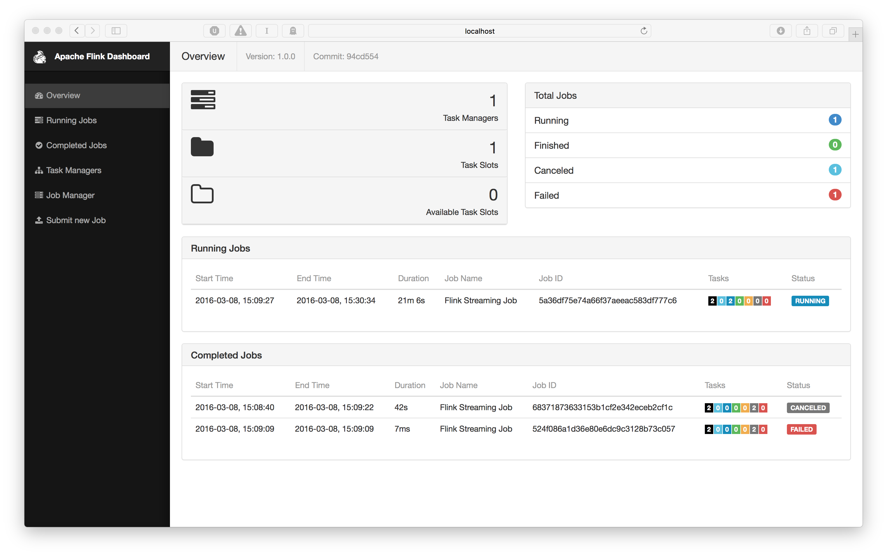
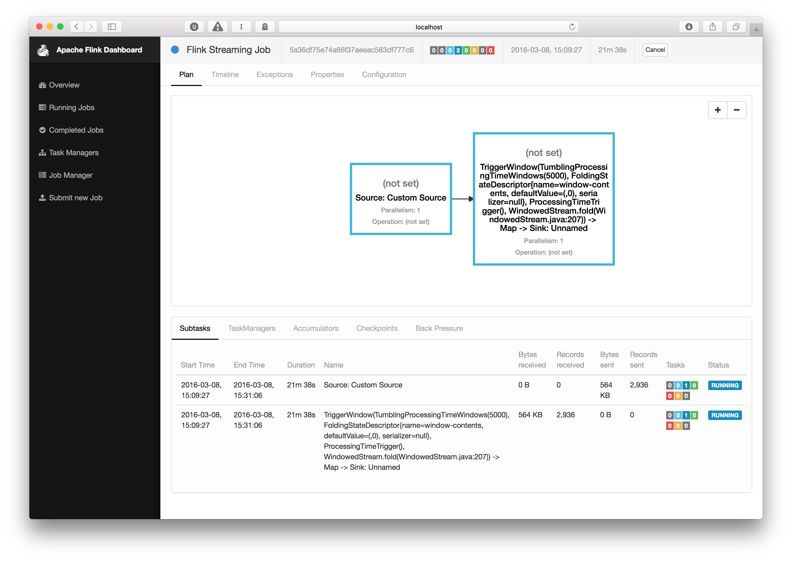

## DataStream API 教程
在本指南中，我们将从零开始，从设置Flink项目到在Flink集群上运行流分析程序。

Wikipedia提供了一个IRC通道，所有对wiki的编辑都记录在这个通道中。我们将在Flink中读取这个通道，并计算每个用户在给定时间内编辑的字节数。这很容易在几分钟内使用Flink实现，但它将为您提供一个良好的基础，您可以在此基础上开始自己构建更复杂的分析程序。

### Setting up a Maven Project
我们将使用Flink Maven原型来创建我们的项目结构。有关这方面的更多信息，请参见[Java API Quickstart]()。对于我们的目的，要运行的命令如下:
```bash
$ mvn archetype:generate \
    -DarchetypeGroupId=org.apache.flink \
    -DarchetypeArtifactId=flink-quickstart-java \
    -DarchetypeVersion=1.9.0 \
    -DgroupId=wiki-edits \
    -DartifactId=wiki-edits \
    -Dversion=0.1 \
    -Dpackage=wikiedits \
    -DinteractiveMode=false
```

如果您愿意，可以编辑groupId、artifactId和package。使用上述参数，Maven将创建一个项目结构，如下图所示:
```bash
$ tree wiki-edits
wiki-edits/
├── pom.xml
└── src
    └── main
        ├── java
        │   └── wikiedits
        │       ├── BatchJob.java
        │       └── StreamingJob.java
        └── resources
            └── log4j.properties
```

这是我们的pom.xml文件，它已经在根目录中添加了Flink依赖项，以及src/main/java中的几个Flink程序示例。我们可以删除示例程序，因为我们要从头开始:
```bash
$ rm wiki-edits/src/main/java/wikiedits/*.java
```

作为最后一步，我们需要添加Flink Wikipedia连接器作为依赖项，以便在程序中使用它。编辑pom.xml的dependencies部分，使它看起来像这样:
```xml
<dependencies>
    <dependency>
        <groupId>org.apache.flink</groupId>
        <artifactId>flink-java</artifactId>
        <version>${flink.version}</version>
    </dependency>
    <dependency>
        <groupId>org.apache.flink</groupId>
        <artifactId>flink-streaming-java_2.11</artifactId>
        <version>${flink.version}</version>
    </dependency>
    <dependency>
        <groupId>org.apache.flink</groupId>
        <artifactId>flink-clients_2.11</artifactId>
        <version>${flink.version}</version>
    </dependency>
    <dependency>
        <groupId>org.apache.flink</groupId>
        <artifactId>flink-connector-wikiedits_2.11</artifactId>
        <version>${flink.version}</version>
    </dependency>
</dependencies>
```

Notice the flink-connector-wikiedits_2.11 dependency that was added. (This example and the Wikipedia connector were inspired by the Hello Samza example of Apache Samza.)

### writing-a-flink-program
编码时间。启动您最喜欢的IDE，导入Maven项目，或者打开文本编辑器，创建文件src/main/java/wikiedits/WikipediaAnalysis.java:
```java
package wikiedits;

public class WikipediaAnalysis {

    public static void main(String[] args) throws Exception {

    }
}
```

这个程序现在很基础，但我们会边做边填。注意，这里我不会给出import语句，因为ide可以自动添加它们。在本节的最后，如果您只是想跳过前面的步骤并在编辑器中输入导入语句，那么我将使用import语句展示完整的代码。

Flink程序的第一步是创建一个StreamExecutionEnvironment(如果正在编写批处理作业，则为ExecutionEnvironment)。这可以用来设置执行参数并创建从外部系统读取的源。我们把这个添加到main方法中:
```java
StreamExecutionEnvironment see = StreamExecutionEnvironment.getExecutionEnvironment();
```

接下来，我们将创建一个从Wikipedia IRC日志中读取的源代码:
```java
DataStream<WikipediaEditEvent> edits = see.addSource(new WikipediaEditsSource());
```

这创建了一个`WikipediaEditEvent`元素的数据流，我们可以进一步处理它。对于本例，我们感兴趣的是确定每个用户在特定时间窗口(比如5秒)中添加或删除的字节数。为此，我们首先必须指定要在用户名上对流进行键操作，也就是说，对该流的操作应该考虑到用户名。在我们的例子中，窗口中编辑字节的总和应该是每个唯一用户的字节数。对于键控流，我们必须提供一个键选择器，像这样:
```java
KeyedStream<WikipediaEditEvent, String> keyedEdits = edits
    .keyBy(new KeySelector<WikipediaEditEvent, String>() {
        @Override
        public String getKey(WikipediaEditEvent event) {
            return event.getUser();
        }
    });
```

这给了我们一个WikipediaEditEvent流，它有一个字符串键，即用户名。现在，我们可以指定希望将窗口应用于此流，并基于这些窗口中的元素计算结果。窗口指定要在其上执行计算的流的一个片段。当计算无限元素流上的聚合时，需要使用Windows。在我们的例子中，我们想要每5秒聚合一次编辑的字节数:

```java
DataStream<Tuple2<String, Long>> result = keyedEdits
    .timeWindow(Time.seconds(5))
    .aggregate(new AggregateFunction<WikipediaEditEvent, Tuple2<String, Long>, Tuple2<String, Long>>() {
        @Override
        public Tuple2<String, Long> createAccumulator() {
            return new Tuple2<>("", 0L);
        }

        @Override
        public Tuple2<String, Long> add(WikipediaEditEvent value, Tuple2<String, Long> accumulator) {
            accumulator.f0 = value.getUser();
            accumulator.f1 += value.getByteDiff();
            return accumulator;
        }

        @Override
        public Tuple2<String, Long> getResult(Tuple2<String, Long> accumulator) {
            return accumulator;
        }

        @Override
        public Tuple2<String, Long> merge(Tuple2<String, Long> a, Tuple2<String, Long> b) {
            return new Tuple2<>(a.f0, a.f1 + b.f1);
        }
    });
```

第一个调用. timewindow()指定我们希望有5秒的翻滚(非重叠)窗口。第二个调用为每个惟一键指定每个窗口片上的聚合转换。在我们的例子中，我们从一个初始值(""，0L)开始，并将该时间窗口中每个编辑的字节差添加到其中。结果流现在包含一个Tuple2<String，每个用户对应一个长>，每5秒发出一次。

剩下唯一要做的就是打印流到控制台并开始执行:
```java
result.print();

see.execute();
```

最后一个调用是启动实际Flink作业所必需的。所有操作，例如创建源、转换和接收，都只构建内部操作的图。只有在调用execute()时，这个操作图才会被抛出到集群或在本地机器上执行。

完整的代码是这样的:
```java
package wikiedits;

import org.apache.flink.api.common.functions.AggregateFunction;
import org.apache.flink.api.java.functions.KeySelector;
import org.apache.flink.api.java.tuple.Tuple2;
import org.apache.flink.streaming.api.datastream.DataStream;
import org.apache.flink.streaming.api.datastream.KeyedStream;
import org.apache.flink.streaming.api.environment.StreamExecutionEnvironment;
import org.apache.flink.streaming.api.windowing.time.Time;
import org.apache.flink.streaming.connectors.wikiedits.WikipediaEditEvent;
import org.apache.flink.streaming.connectors.wikiedits.WikipediaEditsSource;

public class WikipediaAnalysis {

  public static void main(String[] args) throws Exception {

    StreamExecutionEnvironment see = StreamExecutionEnvironment.getExecutionEnvironment();

    DataStream<WikipediaEditEvent> edits = see.addSource(new WikipediaEditsSource());

    KeyedStream<WikipediaEditEvent, String> keyedEdits = edits
      .keyBy(new KeySelector<WikipediaEditEvent, String>() {
        @Override
        public String getKey(WikipediaEditEvent event) {
          return event.getUser();
        }
      });

    DataStream<Tuple2<String, Long>> result = keyedEdits
      .timeWindow(Time.seconds(5))
      .aggregate(new AggregateFunction<WikipediaEditEvent, Tuple2<String, Long>, Tuple2<String, Long>>() {
        @Override
      	public Tuple2<String, Long> createAccumulator() {
      	  return new Tuple2<>("", 0L);
      	}

      	@Override
      	public Tuple2<String, Long> add(WikipediaEditEvent value, Tuple2<String, Long> accumulator) {
      	  accumulator.f0 = value.getUser();
      	  accumulator.f1 += value.getByteDiff();
          return accumulator;
      	}

      	@Override
      	public Tuple2<String, Long> getResult(Tuple2<String, Long> accumulator) {
      	  return accumulator;
      	}

      	@Override
      	public Tuple2<String, Long> merge(Tuple2<String, Long> a, Tuple2<String, Long> b) {
      	  return new Tuple2<>(a.f0, a.f1 + b.f1);
      	}
      });

    result.print();

    see.execute();
  }
}
```
你可以在IDE或命令行上运行这个例子，使用Maven:
```bash
$ mvn clean package
$ mvn exec:java -Dexec.mainClass=wikiedits.WikipediaAnalysis
```

第一个命令构建我们的项目，第二个命令执行我们的主类。输出应该类似如下:
```
1> (Fenix down,114)
6> (AnomieBOT,155)
8> (BD2412bot,-3690)
7> (IgnorantArmies,49)
3> (Ckh3111,69)
5> (Slade360,0)
7> (Narutolovehinata5,2195)
6> (Vuyisa2001,79)
4> (Ms Sarah Welch,269)
4> (KasparBot,-245)
```

每行前面的数字告诉您输出是在哪个并行的打印接收器实例上生成的。

这应该让您开始编写自己的Flink程序。要了解更多信息，可以查看我们关于基本概念和DataStream API的指南。如果您想学习如何在自己的机器上设置Flink集群并将结果写入Kafka，请继续阅读额外的练习。

### Bonus Exercise: Running on a Cluster and Writing to Kafka
请遵循我们的本地安装教程在您的机器上设置Flink发行版，并参考Kafka quickstart在继续之前设置Kafka安装。

作为第一步，我们必须添加Flink Kafka连接器作为依赖项，以便我们可以使用Kafka接收器。将其添加到依赖项部分的pom.xml文件中:
```xml
<dependency>
    <groupId>org.apache.flink</groupId>
    <artifactId>flink-connector-kafka-0.11_2.11</artifactId>
    <version>${flink.version}</version>
</dependency>
```

接下来，我们需要修改我们的程序。我们将删除print()接收器，而使用Kafka接收器。新代码如下:
```java
result
    .map(new MapFunction<Tuple2<String,Long>, String>() {
        @Override
        public String map(Tuple2<String, Long> tuple) {
            return tuple.toString();
        }
    })
    .addSink(new FlinkKafkaProducer011<>("localhost:9092", "wiki-result", new SimpleStringSchema()));
```

相关类也需要导入:
```java
import org.apache.flink.streaming.connectors.kafka.FlinkKafkaProducer011;
import org.apache.flink.api.common.serialization.SimpleStringSchema;
import org.apache.flink.api.common.functions.MapFunction;
```

注意，我们首先使用MapFunction将Tuple2<String, Long>的流转换为字符串流。我们这样做是因为将普通字符串写入Kafka更容易。然后，我们创建一个Kafka sink。您可能需要根据您的设置调整主机名和端口。“wiki-result”是我们接下来将在运行程序之前创建的Kafka流的名称。使用Maven构建项目，因为我们需要jar文件在集群上运行:
```bash
$ mvn clean package
```

生成的jar文件将位于目标子文件夹中:`target/wiki-edits-0.1.jar`。我们稍后会用到它。

现在，我们准备启动一个Flink集群并运行在其上编写Kafka的程序。转到安装Flink的位置并启动本地集群:
```bash
$ cd my/flink/directory
$ bin/start-cluster.sh
```

我们还必须创建卡夫卡主题，以便我们的程序可以写它:
```bash
$ cd my/kafka/directory
$ bin/kafka-topics.sh --create --zookeeper localhost:2181 --replication-factor 1 --partitions 1 --topic wiki-results
```

现在我们可以在本地Flink集群上运行jar文件了:
```bash
$ cd my/flink/directory
$ bin/flink run -c wikiedits.WikipediaAnalysis path/to/wikiedits-0.1.jar
```

如果一切按计划进行，该命令的输出应该类似如下:
```log
03/08/2016 15:09:27 Job execution switched to status RUNNING.
03/08/2016 15:09:27 Source: Custom Source(1/1) switched to SCHEDULED
03/08/2016 15:09:27 Source: Custom Source(1/1) switched to DEPLOYING
03/08/2016 15:09:27 Window(TumblingProcessingTimeWindows(5000), ProcessingTimeTrigger, AggregateFunction$3, PassThroughWindowFunction) -> Sink: Print to Std. Out (1/1) switched from CREATED to SCHEDULED
03/08/2016 15:09:27 Window(TumblingProcessingTimeWindows(5000), ProcessingTimeTrigger, AggregateFunction$3, PassThroughWindowFunction) -> Sink: Print to Std. Out (1/1) switched from SCHEDULED to DEPLOYING
03/08/2016 15:09:27 Window(TumblingProcessingTimeWindows(5000), ProcessingTimeTrigger, AggregateFunction$3, PassThroughWindowFunction) -> Sink: Print to Std. Out (1/1) switched from DEPLOYING to RUNNING
03/08/2016 15:09:27 Source: Custom Source(1/1) switched to RUNNING
```

您可以看到各个操作符是如何开始运行的。只有两个，因为出于性能原因，窗口后的操作被折叠成一个操作。在Flink中，我们称之为链接。

您可以通过使用Kafka console consumer检查Kafka主题来观察程序的输出:
```bash
bin/kafka-console-consumer.sh  --zookeeper localhost:2181 --topic wiki-result
```
您还可以查看Flink仪表板，它应该在http://localhost:8081处运行。您将得到集群资源和正在运行的作业的概述:



如果你点击你正在运行的作业，你会看到一个视图，在那里你可以检查单独的操作，例如，看到处理过的元素的数量:



这就结束了我们的Flink之旅。如果您有任何问题，请随时在我们的邮件列表中提出。